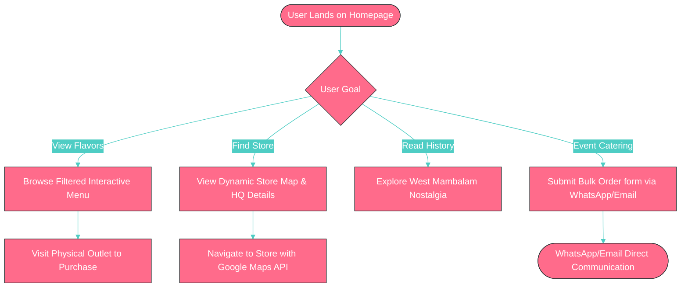
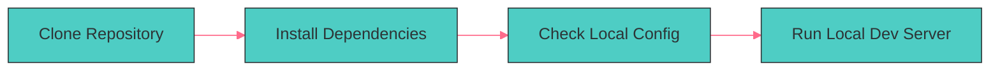
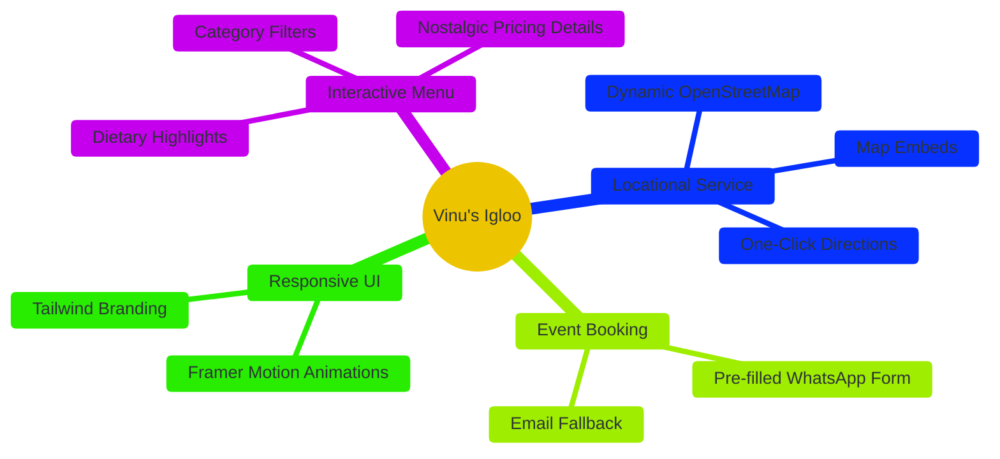
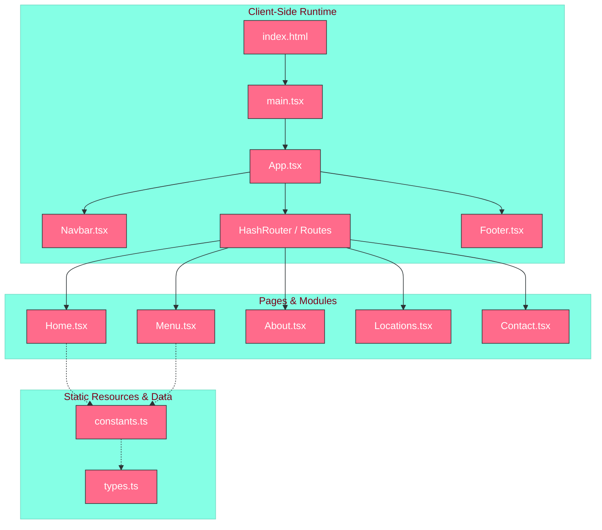

<div align="center">

# Vinu's Igloo
### Chennai's Favorite Ice Cream Shop Web Application
[](LICENSE) [](https://react.dev) [](https://vite.dev) [](https://typescriptlang.org)

An ultra-polished, animated storefront built in React and Tailwind CSS that delivers the digital menu, brand heritage, and store locations for Chennai's legendary soft-serve parlor.

</div>

---

## Visual User Journey



The system funnels digital traffic directly into high-conversion actions such as in-store visits or direct-to-WhatsApp bulk event booking inquiries.

This architecture ensures a zero-friction frontend that works seamlessly across all modern mobile and desktop screens.

---

## Why This?

| Feature | This Project | Static Site Templates | Generic Food Delivery Apps |
| :--- | :--- | :--- | :--- |
| **High Performance** | ✅ Sub-second page rendering and instant page changes | ❌ Heavy bloated layouts | ❌ High platform commission overhead |
| **Bespoke Branding** | ✅ Playful, interactive custom animations and brand-specific theme | ❌ Plain, generic design | ❌ Standard grid layout with no unique brand voice |
| **Zero Server Cost** | ✅ 100% Client-side React deployment with zero database costs | ✅ Low complexity | ❌ Continuous infrastructure subscription fees |
| **Direct Customer Connect**| ✅ Instant integration with WhatsApp for catering leads | ❌ Hard to customize | ❌ Automated support chat walls |

By combining the lightweight footprint of a single-page application with immediate WhatsApp checkout triggers, this platform acts as a powerful brand asset that avoids complex and expensive web servers.

---

## Quick Start



### Prerequisites

| Tool | Version | Purpose |
| :--- | :--- | :--- |
| **Node.js** | `>=18.x` | JavaScript runtime environment |
| **npm** | `>=9.x` | Package manager |

### Getting Started

1. Clone the repository to your local machine:
```bash
git clone https://github.com/rahulcvwebsitehosting/vishnu.git
cd vishnu
```

2. Install the necessary node packages:
```bash
npm install
```

3. Run the development server locally:
```bash
npm run dev
```

4. Compile the application for production build:
```bash
npm run build
```

---

## Core Features



### 🍦 Interactive Menu
The application features a fast-filtering menu that displays individual categories like Softies, Drinks, and Sundaes dynamically.
```typescript
// Uses reactive states to filter menu listings with zero latency
const filteredItems = filter === 'all' 
  ? MENU_ITEMS 
  : MENU_ITEMS.filter(item => item.category === filter);
```

### 🗺️ Locational Service
The platform highlights physical outlet branches with responsive map viewport rendering and one-click navigation hooks.
```typescript
// Built-in fail-safe embed frames to guide desktop and mobile buyers
<iframe src={activeBranch.mapUrl} referrerPolicy="no-referrer-when-downgrade"></iframe>
```

### 📱 Event Booking
Enables bulk catering lead ingestion by serializing form fields directly into active messaging API payloads.
```typescript
// Custom pre-formatted WhatsApp string builder to avoid backend dependencies
const waUrl = `https://wa.me/${phoneNumber}?text=${formattedDetails}`;
```

---

## System Architecture



### Project Structure

```text
/
├── index.html            # Main entry HTML file
├── package.json          # Node package definition
├── tsconfig.json         # TypeScript compiler configurations
├── vite.config.ts        # Vite application bundler rules
└── src/                  # Main source files
    ├── main.tsx          # App mounter entry point
    ├── App.tsx           # Primary routing module
    ├── index.css         # Tailwind v4 directives and theme variables
    ├── constants.ts      # Frozen menu datasets and addresses
    ├── types.ts          # Shared structural type definitions
    ├── components/       # Global static design segments
    │   ├── Navbar.tsx    # Responsive navigation bar
    │   └── Footer.tsx    # Trademark footer with action handles
    └── pages/            # View managers
        ├── Home.tsx      # Main landing structure
        ├── Menu.tsx      # Interactive catalog interface
        ├── About.tsx     # Heritage record view
        ├── Locations.tsx # Branch navigation center
        └── Contact.tsx   # Bulk inquiry generator
```

### Component Breakdown

| Module | Language | Purpose |
| :--- | :--- | :--- |
| `App.tsx` | TypeScript (TSX) | Orchestrates view state switching and navigation hierarchy |
| `Home.tsx` | TypeScript (TSX) | Renders the primary landing visuals and popular items |
| `Menu.tsx` | TypeScript (TSX) | Filters catalog products by category and active selections |
| `Locations.tsx` | TypeScript (TSX) | Renders physical storefront addresses and map portals |
| `Contact.tsx` | TypeScript (TSX) | Collects bulk inquiry forms and exports to instant messaging triggers |

---

## Development Guide

### Environment Configuration

The development configuration uses default properties managed by Vite and requires no additional database servers.

To launch a secure local environment, execute:
```bash
npm run dev -- --host 0.0.0.0
```

### Production Bundling

To compile static assets for delivery on edge hosting platforms, execute:
```bash
npm run build
```

This compiles a minified and optimized production package into the `dist/` directory.

---

## Honest Maintenance & Technical Debt

### Long-term Support Considerations
Because this application is built as a complete client-side single-page layout, it avoids database security risks and backend operating costs entirely.

However, any future changes to menu items, price rates, or store operating hours require manual code updates to the `src/constants.ts` file.

### Dependency Management
Major updates to third-party assets like Framer Motion or React Router must be carefully reviewed to prevent runtime routing and layout failures.

We recommend pinning major dependency versions and running type-checks during future package upgrades.

---

## FAQ

### Can I run this offline?
Yes, the application assets are statically bundled and can be fully run offline in a cached PWA wrapper or local server if needed.

### Is the code open source?
Yes, this project is fully open source and licensed under the MIT License for community extension.

### How is user data protected?
Since there is no centralized backend server, zero user logs, transaction inputs, or customer data are ever retained or processed by us.

### Does this require API keys?
No, the map and WhatsApp redirect portals use standard URL schemas that do not require secret API authorization keys.

### Can I add extra branches easily?
Yes, simply append a new branch configuration object to the `BRANCHES` array located inside the `src/constants.ts` file.

### Can it run in a headless layout?
No, this interface is designed as an interactive, highly visual frontend storefront and is not structured for headless data output.

---

## Contributing

To suggest corrections or introduce new improvements to the codebase, follow these direct steps:

* Report bug issues in the active **GitHub Issue Tracker**.
* Submit structural improvements through **Pull Requests**.

```bash
# Branch out before preparing your pull requests
git checkout -b feature/your-awesome-feature
git commit -m "Add descriptive feature updates"
git push origin feature/your-awesome-feature
```

Ensure all your code changes successfully pass the local type checks by executing `npm run lint` before creating a pull request.

---

## License & Attribution

Distributed under the **MIT License**. See `LICENSE` for the detailed license agreement.

Built with appreciation for the culinary legacy of Vinu's Igloo in West Mambalam, Chennai.
